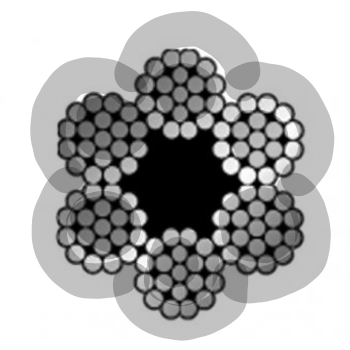

<br/><br/>

Una de las principales caracteristicas de una variable aleatoria es su función de probabilidad $f(x)$, la cual determina su valor esperado, varianza y además permite calcular tanto probabilidades puntuales en el caso de las varables discretas como tambien en intervalos  tanto para variables aleatorias discretas como para variables continuas.

<br/>

Es posible emplear los modelos de probabilidad para simular variables aleatorias asociadas situaciones reales utilizando para ello funciones que generan números aleatorios que se puedan asociar a una determinada distribución de probabilidad.


Por ejemplo, la función `rnorm(50, mean = 100 , sd = 10)` , genera `50` números aleatorios con distribución aproximadamente normal con media `100` y desviación estandar $10$. 

Mientras que la función `rbinom(50, size=10, prob=0.3)`, genera una muestra aleatoria de `50` números con distribución binomial con parámetros : `n = 10` y `p = 0.30`.

Los siguientes problemas requieren los conceptos de  probabilidad y variable aleatoria, revisados en la Unidad 2 del curso. Siguiendo los pasos descritos podrás dar solución a los interrogantes


<br/><br/>

Tambien se hará uso de la función `apply(X,MARGIN, FUN)`,  donde `X` representa una matriz - data.frame - , `MARGIN` tomará el valor de $1$ indicando que la funcion descrita en `FUN`se realiza por filas o $2$ cuando se ejecuta por columnas y finalmente `FUN` que corresponde a la función a ejecutar.  Por ejemplo: `apply(X,1,min)` , da como resultado un vector de los minimos obtenidos para cada fila de la matriz `X`

<br/><br/>

## <span style="color:#FF7F00"> **Problema 1**</span>
## <span style="color:#034A94">**El cable quebradizo**</span>

Un cable está compuesto por seis alambres. La fuerza de ruptura de cada alambre es una variable aleatoria distribuida normalmente con media de $10 kN$ y desviación estándar de $1 kN$ ($kN$=kiloNewton=$10^{3}N$). Utilizando el método de cable quebradizo, se estima que la fuerza del cable es igual a la fuerza de alambre más frágil multiplicada por el número de alambres.

```{r, echo=FALSE, out.width="15%", fig.align = "center"}

```
<br/><br/>

a. Utilice una muestra simulada de tamaño 1000 para estimar la fuerza media de este tipo de cable.

```{r, eval=FALSE}
cable=data.frame(
a1 = rnorm(1000, 10,1),
a2= rnorm(1000, 10,1),
a3= rnorm(1000, 10,1),
a4= rnorm(1000, 10,1),
a5= rnorm(1000, 10,1),
a6= rnorm(1000, 10,1))
fuerza=apply(cable,1,min)*6

```

<br/><br/>

b. Estime la mediana de la fuerza del cable.

```{r, eval=FALSE}
mean(fuerza)
```
<br/><br/>

c. Estime la desviación estándar de la fuerza del cable.
```{r, eval=FALSE}
sd(fuerza)
```
<br/><br/>

d. Para que sea aceptable en cierta obra, la probabilidad de que el cable se rompa con una carga de $60 kN$ debe ser menor a $0.01$. ¿Parece ser que el cable es aceptable? Explique.

```{r, eval=FALSE}
probD=sum(as.numeric(fuerza>60))/1000
probD
```


<br/><br/><br/><br/>


## <span style="color:#FF7F00"> **Problema 2**</span>
## <span style="color:#034A94">**Partes defectuosas**</span>


Victor distribuye partes para motocicletas, y se estima que cada una de ellas tiene una probabilidad de $0.03$ de estar defectuosa. José  tambien distribuye partes semejantes  y su producto tiene  una probabilidad de $0.05$ de estar defectuoso. Usted recibe un envío de $100$ partes procedente de cada vendedor (Victor  y José). 

```{r, echo=FALSE, out.width="45%", fig.align = "center"}
knitr::include_graphics("img/moto.png")
```

<br/><br/>

a. Sea $X$ el número de partes defectuosas en el envío proveniente del almacén de Victor  y $Y$ del número de partes defectuosas provenientes del almacén de José . ¿Cuáles son las distribuciones de las variables $X$ y $Y$? 

```{r, eval=FALSE}
data=data.frame(
X=rbinom(1000,100,0.03),
Y=rbinom(1000,100,0.05))
defectuosas=apply(data, 1,sum)
```

<br/><br/>

b. Genere muestras simuladas de tamaño $1000$ a partir de las distribuciones de $X$ y $Y$. 

c. Utilice las muestras para estimar la probabilidad de que el número total de partes defectuosas sea menor a diez. 

d. Utilice las muestras para estimar la probabilidad de que el envío de Victor tiene más partes defectuosas que el envío de José.

e. Construya una gráfica de probabilidad normal para el número total de partes defectuosas. ¿La cantidad sigue una distribución normal?

```{r, eval=FALSE}
hist(defectuosas)
plot(density(defectuosas))
```


<br/><br/>

Ejercicios tomados de Navidi(2006)

